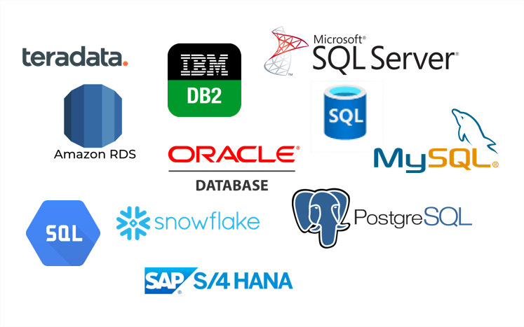

# Hands-on Flask-05 : Handling SQL with Flask Web Application

Purpose of the this hands-on training is to give the students introductory knowledge of how to handle forms, how to connect to database and how to use sql within Flask web application on Amazon Linux 2 EC2 instance. 

## Learning Outcomes

At the end of the this hands-on training, students will be able to;

- install Python and Flask framework on Amazon Linux 2 EC2 instance.

- build a web application with Python Flask framework.

- handle forms using the flask-wtf module.

- configure connection to the `sqlite` database.

- configure connection to the `MySQL` database.

- work with a database using the SQL within Flask application.

- use git repo to manage the application versioning.

- run the web application on AWS EC2 instance using the GitHub repo as codebase.

## Outline

- Part 1 - Write a Sample Web Application with SQLite and database implementation on GitHub Repo

- Part 2 - Write same application with MySQL

- Part 3 - Install Python and Flask framework on Amazon Linux 2 EC2 Instance using RDS

## Part 1 - Write a Sample Web Application with SQLite and database implementation on GitHub Repo

- Write an application with database implementation using `SQLite` and save the complete code as `app-with-sqlite.py` under `hands-on/flask-05-handling-sql-on-ec2-linux2` folder.

- configure required environmental variables for SQLite

- drop users table if exists, create new users table and add some rows for sample

- Execute sql commands and commit them

- Write a function named `find_emails` which find emails using keyword from the user table in the db,
- and returns result as tuples `(name, email)`.

- Write a function named `insert_email` which adds new email to users table the db.

- Write a function named `emails` which finds email addresses by keyword using `GET` and `POST` methods,
- using template files named `emails.html` given under `templates` folder
- and assign to the static route of ('/')

- Write a function named `add_email` which inserts new email to the database using `GET` and `POST` methods,
- using template files named `add-email.html` given under `templates` folder
- and assign to the static route of ('add')

- Add a statement to run the Flask application which can be reached from any host on port 80.

## Part 2 - Write same application with MySQL

- Create an RDS database and use it as database of application

- Please write same application that was given in Part2 with MYSQL

- commit your code and push it to your GitHub repo

- Launch an Instance and pull your files in to it

- Run your application on EC2

## Part 3 - Install Python and Flask framework on Amazon Linux 2 EC2 Instance 

- Launch an Amazon EC2 instance using the Amazon Linux 2 AMI with security group allowing SSH (Port 22) and HTTP (Port 80) connections.

- Connect to your instance with SSH.

- Update the installed packages and package cache on your instance.

- Install `Python 3` packages.

- Check the python3 version

- Install `Python 3 Flask` framework.

- Install `flask_mysql`.

- Run application with Python

